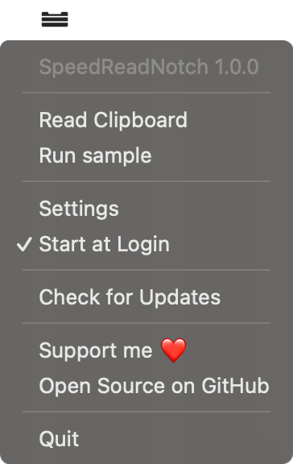
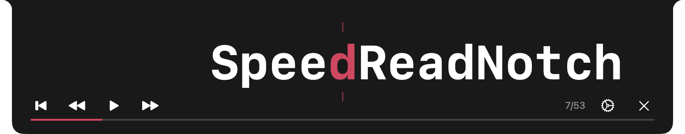
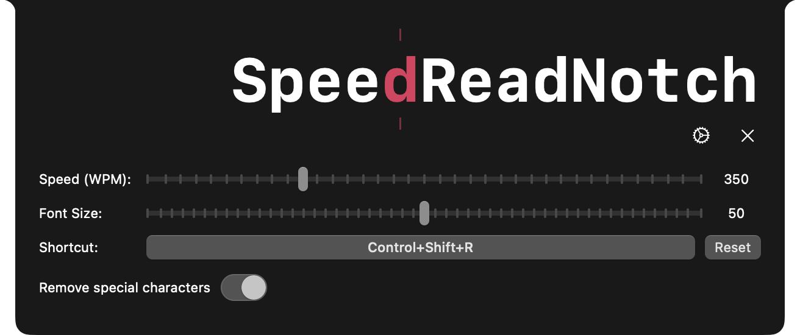

<h1 align="center">
  
</h1>

# SpeedReadNotch

Native macOS Speed Reading application for the notch. Enhance your reading speed
and comprehension with word-by-word display right in your notch.

## Features

- **Speed Reading**: Display text one word at a time with adjustable
  words-per-minute (WPM) settings
- **Global Shortcut**: Press `Control + Shift + R` to instantly read any
  selected text
- **Notch Integration**: Utilizes your MacBook's notch for unobtrusive reading
- **Customizable Settings**: Adjust reading speed, font size, and more
- **Status Bar Access**: Quick access menu from the status bar

## How It Works: Rapid Serial Visual Presentation

SpeedReadNotch uses **Rapid Serial Visual Presentation (RSRP)** technique to
help you read faster and more efficiently. This proven method works by:

- **Eliminating Subvocalization**: By forcing your brain to process words at an
  accelerated pace, RSRP helps eliminate the tendency to read words out loud in
  your head, which is a major bottleneck in reading speed.
- **Preventing Eye Backtracking**: The word-by-word sequential display
  suppresses the natural tendency for your eyes to backtrack along the line
  while reading, a behavior that significantly slows down reading comprehension.
- **Maintaining Comprehension**: Studies have shown that this technique not only
  increases reading speed but also helps maintain or even improve comprehension
  when used properly.

## Shortcuts

| Shortcut | Action |
|----------|--------|
| `Control + Shift + R` | Read selected text (select text first and then press the shortcut) |
| `space` | Pause/Resume reading |
| `Escape` | Stop reading |

## Screenshots

### Tray Menu

### Reading in Action

### Settings

### Completed

## Architecture

Built with Swift and SwiftUI, following native macOS development patterns.

## License

This project is licensed under the MIT - see the [LICENSE](./LICENSE) file for
details.

  

 

  

 

  

