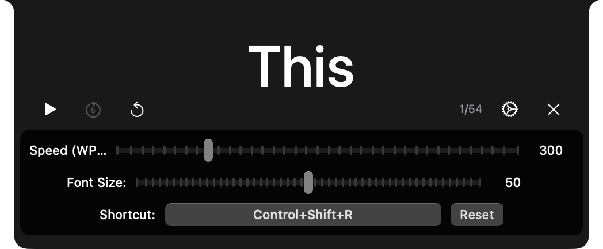

<h1 align="center">
  
</h1>

# SpeedReadNotch

Native macOS Speed Reading application for the notch. Enhance your reading speed
and comprehension with word-by-word display right in your notch.

## Features

- **Speed Reading**: Display text one word at a time with adjustable
  words-per-minute (WPM) settings
- **Global Shortcut**: Press `Command + Shift + R` to instantly read any
  selected text
- **Notch Integration**: Utilizes your MacBook's notch for unobtrusive reading
- **Customizable Settings**: Adjust reading speed, font size, and more
- **Status Bar Access**: Quick access menu from the status bar

## Shortcuts

| Shortcut | Action |
|----------|--------|
| `Command + Shift + R` | Read selected text (select text first and then press the shortcut) |
| `space` | Pause/Resume reading |
| `Escape` | Stop reading |

## Screenshots

### Reading in Action

### Settings

### Countdown

### Completed

## Architecture

Built with Swift and SwiftUI, following native macOS development patterns.

## License

This project is licensed under the MIT - see the [LICENSE](./LICENSE) file for
details.

  

 

  

 

  

